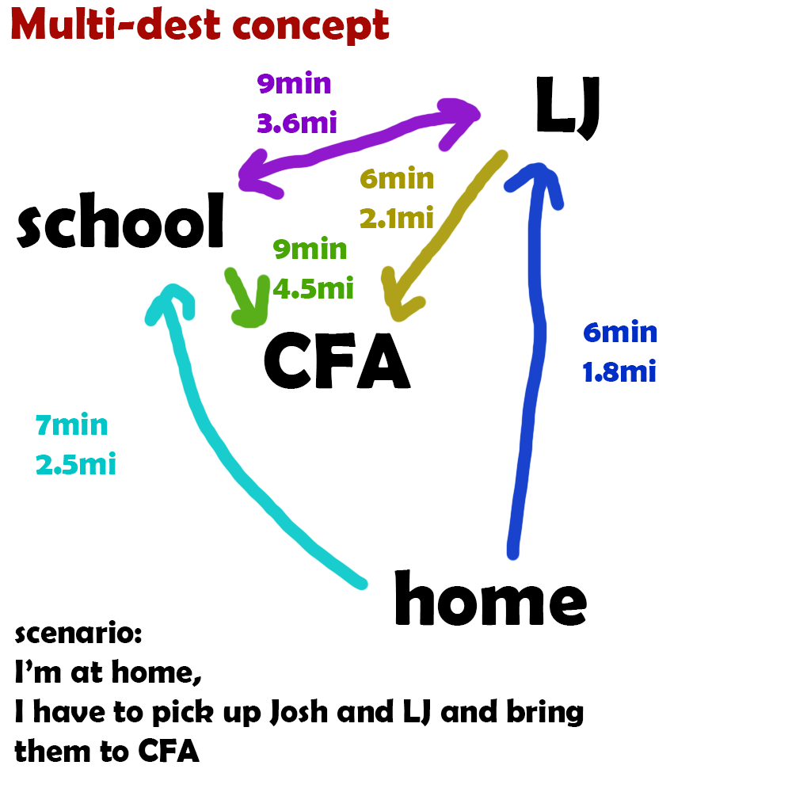
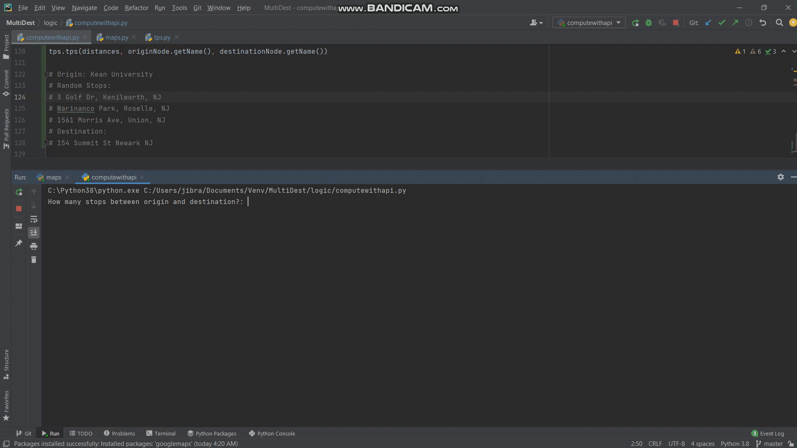

# MultiDest

## With the way Google Maps is currently set up, users can input an origin, a number of "stops" and a destination. 
### Our goal is to optimize travel time or distance using the "travelling salesman problem" algorithm.

*Not for commercial-use or redistribution yet please!
